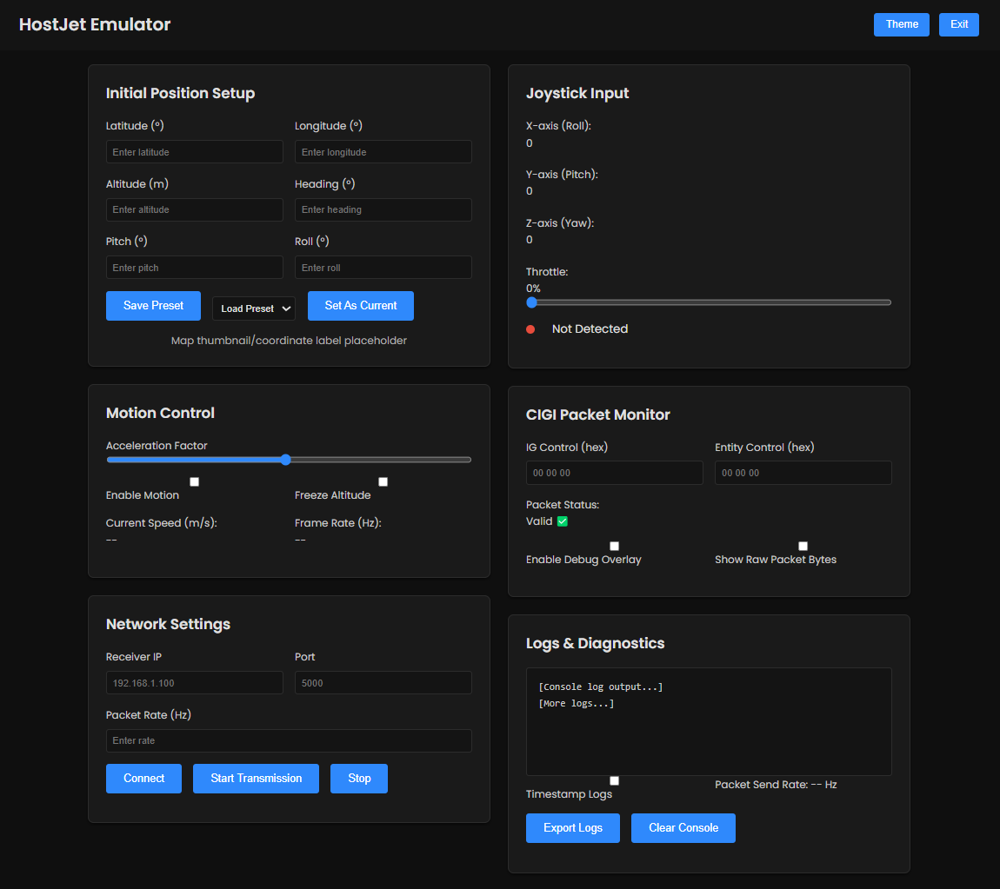

# HostJet 🚀  
**Joystick-Driven Host Emulator for CIGI-Compliant Aircraft Simulation with Integrated User Interface**

---

## 🛠 Overview

**HostJet** is a real-time **host emulator** designed for use with IG that support the **Common Image Generator Interface (CIGI) v3.3** protocol. This emulator simulates a jet's motion in local East-North-Up (ENU) coordinates and sends CIGI packets to an Image Generator (IG) at **60 Hz**.

HostJet integrates a **joystick** to offer interactive and natural flight control. Movement is calculated using basic acceleration physics and converted to valid geospatial coordinates (latitude, longitude, altitude), ensuring full compatibility with visual systems.

The project features a fully functional **user interface** for configuring initial settings, monitoring joystick activity, mapping controls, simulating motion, and debugging packet transmission.

---

## ✈️ Features

- 🧭 **Real-Time Joystick Input**  
  Control pitch, yaw, and heading dynamically using a joystick instead of keyboard input.

- 🌍 **ENU-Based Motion with Geo Conversion**  
  Aircraft motion starts from a defined position (e.g., over Riyadh) and is calculated in meters, then converted to geographic coordinates.

- 📦 **CIGI 3.3-Compliant Packet Generation**  
  Sends valid IG Control and Entity Control packets using the CIGI protocol.

- 🚦 **Orientation & Range Safety**  
  Implements clamping to keep latitude in [-90°, 90°] and longitude in [-180°, 180°] to avoid out-of-range exceptions in IG.

- 🔄 **Multithreaded Operation**  
  Uses asynchronous networking to send packets and read inputs in parallel.

---

## 🖥️ User Interface

🧭 **1. Initial Position Pre-Setter**  
- 🌍 Dropdown or Map Selector for choosing starting location (e.g., Riyadh, Tabuk, Neom, custom GPS)  
- 🧾 Manual Input Fields for:  
  - Latitude / Longitude  
  - Altitude (m)  
  - Heading / Pitch / Roll  
- 📌 Save as Preset button  

🎮 **2. Live Joystick Status Monitor**  
- Realtime display of joystick values:  
  - Pitch, Roll, Yaw axes  
  - Throttle / trigger / button states  
- Visual indicators or sliders to debug input  

🕹️ **3. Joystick Mapping Configuration**  
- Option to remap joystick axis to:  
  - Yaw, pitch, roll  
  - Throttle or velocity factor  
- Sensitivity and dead zone settings  

🚁 **4. Motion Simulation Panel**  
- Toggle:  
  - Enable/disable motion  
  - Freeze altitude  
- Sliders for:  
  - Acceleration factor  
  - Motion smoothing / damping  
- Current frame rate / update rate display (e.g., 60 Hz)  

🌐 **5. Network & IG Control**  
- Input fields for:  
  - Destination IP (IG)  
  - Port number  
  - Packet rate (Hz)  
- Start / Stop packet transmission  
- Display current IG frame number (if SOF packets are received)  

🔄 **6. CIGI Packet Preview / Debug**  
- Live hex viewer of:  
  - IG Control packet  
  - Entity Control packet  
  - Last N packets sent  
- Flags: valid, out-of-range, clamped, dropped, etc.  

📋 **7. Logging & Diagnostics**  
- Logging options:  
  - Position updates  
  - Joystick activity  
  - CIGI transmission stats  
- Export to `.csv` or `.log`  
- Timestamped diagnostics panel  

---

## 🔧 Tech Stack

| Tool / Library                        | Purpose                                                                 |
|--------------------------------------|-------------------------------------------------------------------------|
| **C++17**                             | Core language for simulation and host logic                            |
| **Boost.Asio** (`boost_1_81_0`)       | Networking layer for CIGI UDP packet transmission                      |
| **CIGI Class Library (CCL) v3.3**     | Packet definition and IG communication (IG Control, Entity Control)    |
| **Windows Joystick API / DirectInput**| Real-time joystick input for heading, pitch, and roll control          |
| **Multithreading (std::thread)**      | Runs joystick capture, SOF listening, and packet generation concurrently |
| **Custom ENU-to-Geo Converter**       | Converts local movement in meters to lat/lon degrees                   |
| **Math/Physics Utilities**            | Computes acceleration-based motion and orientation updates             |

---

## 📍 Starting Position

The jet starts at a local position that corresponds to a real-world location over **Riyadh, Saudi Arabia**, and simulates movement using acceleration vectors based on joystick input.

---

## 🚀 How to Run

1. **Connect your joystick** via USB.  
2. Build the project using your preferred C++ IDE or `CMake`.  
3. Make sure your IG is listening on the correct IP/port for CIGI input.

---

## ✅ Future Improvements
 
- Joystick button mappings for switching views or weapons  
- Flight path recorder  

---

## 🧠 Author

**[Adeeb Alqahtani]**  
🛰 Software Integration Engineer
🔗 [LinkedIn](https://www.linkedin.com/in/adalqahtani)  
🌐 [Website](https://theadeeb.com)
